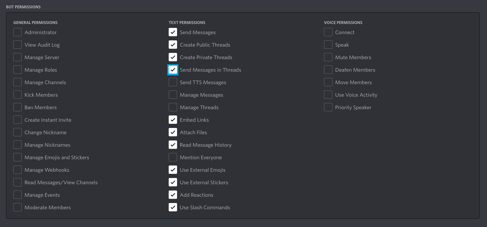

# Thingy

Discord bot that integrates with DiscoArt, adding a slick user interface to play around with you and your friends!

[Demo video + dev journey](https://www.youtube.com/watch?v=epLF0OXTp-A)

# DiscoArt?!

Check out the [DiscoArt repo](https://github.com/jina-ai/discoart) for what this is all about!

In short: this bot allows you to generate images based on a text prompt, but can do way more than just that - offering a wide variety of tools to make alter your generated images.

# Credits and special thanks

 - First and foremost Han Xiau for being around in DMs helping me with what I struggled with but also putting me on the right direction in various moments.
 - [DiscoArt](https://github.com/jina-ai/discoart): without this project, I was never able to cook this up in a weekend.
 - [Jina](https://jina.ai) which has some incredible tooling I got familiar with.

# Demo

[My discord server](https://discord.gg/j4wQYhhvVd) has the bot running, however, keep in mind that currently, it runs on a single RTX3080, so it might be slow in busy times.

# Run it yourself!

As this bot is open-source, anyone can run it. What you need:

 - A good GPU
 - Docker
 - Linux (Windows probably works, but the author of this project doesn't use Windows, so it's untested and you may have to adjust the steps accordinly)
 - Kotlin/Gradle setup (IntelliJ Community Edition works great)
 - Discord account and bot (more on this later)

## Setting up Jina's DiscoArt

- Start by cloning this repo
- Create an empty folder, this is to keep your Jina config
- Inside this folder, create a file named `flow.yml` with the following content:
```yml
jtype: Flow
with:
  protocol: grpc
  monitoring: false
  cors: true
  port: 51001
  port_monitoring: 51002
  env:
    JINA_LOG_LEVEL: debug
    DISCOART_DISABLE_IPYTHON: 1
    DISCOART_DISABLE_RESULT_SUMMARY: 1
executors:
  - name: discoart
    uses: DiscoArtExecutor
    env:
      CUDA_VISIBLE_DEVICES: RR0:2  # change this if you have multiple GPU
    replicas: 1  # change this if you have larger VRAM
    floating: true  # new feature in Jina 3.7, set this to true allows `create` to be immediately returned without waiting the response on the client
  - name: poller
    uses: ResultPoller
```
- `cd` to this folder, and run the following command: `docker run --rm --net=host -v $(pwd):/app -v $(pwd)/cache:/root/.cache --name=jina_discord_processor --gpus all jinaai/discoart python -m discoart serve /app/flow.yml`
- Congrats, you got your AI server running!

## Setting up the bot

- Inside the repo, copy `config.example.yml` to `config.yml` (this is where your bot config is in)
- Create a Discord application on their [developer portal](https://discord.com/developers/applications/me)
- Make a discord bot by clicking on the Bot menu, and click "Add Bot". Name it as you like.
- Click "Reset Token" to reveal the bot token. Make note of this token, you need it in the next step.
- In the config, change the bot name and token to your bot token.
- Assuming you run the Jina server as well as the Discord bot on the same machine, you don't need to do anything.
    - If your Jina server is remote, you have to change `host` and `port` under `grpcServer`
- Save the config.
- Go to the OAuth2 menu, and click the URL Generator submenu. Check off the Bot checkbox.
- In bot permissions, you only need the following:
    
- After you have done this, you can copy the link and invite the bot into your server.
- Run the bot using `./gradlew run` and you should be able to use `/make`!